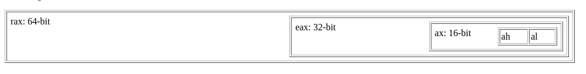

#


## Intex Syntax
instruction   dest,source

example:
```
_start:
       ...
function_name:
       ...
.local_label:
       ...
```
local_label belongs to its function

## Compile
nasm -f elf64 -o file.o file.s
ld -o program file.o
./program

## Debug
nasm -f elf64 file.s -g -F dwarf
ld file.o -o program
gdb -tui ./program
set args <function name> <args>
break <function name>
run
si (to move to the next line in code) or ni and enter
info register to see the address of the registers
p (char*) $rdi to see the content of the register

## Registers
```text
       +------------------------+
       |          CPU           |
       |  +------------------+  |
       |  |    Registers     |  |
       |  +------------------+  |
       +-----------+------------+
                   |
                   | Bus (communication channel)
                   |
       +-----------v------------+
       |          RAM           |
       |      Main Memory       |
       +------------------------+
```
| Register | Purpose | Must be preserved by callee? |
|----------|---------|------------------------------|
| `rax` | Temporary register; return value register | No |
| `rbx` | Callee-saved register; optionally used as base pointer | Yes |
| `rcx` | 4th integer/pointer argument | No |
| `rdx` | 3rd integer/pointer argument; 2nd return register | No |
| `rsp` | Stack pointer | Yes |
| `rbp` | Callee-saved register; optionally used as frame pointer | Yes |
| `rsi` | 2nd integer/pointer argument | No |
| `rdi` | 1st integer/pointer argument | No |
| `r8` | 5th integer/pointer argument | No |
| `r9` | 6th integer/pointer argument | No |
| `r10` | Temporary register | No |
| `r11` | Temporary register | No |
| `r12-r15` | Callee-saved registers | Yes |
| `xmm0-xmm1` | Floating-point argument and return registers | No |
| `xmm2-xmm7` | Floating-point argument registers | No |
| `xmm8-xmm15` | Temporary SIMD registers | No |
| `mmx0-mmx7` | Temporary MMX registers | No |
| `st0-st1` | Return registers for `long double` | No |
| `st2-st7` | Temporary x87 registers | No |
| `fs` | Reserved for the system (thread-local storage) | No |
| `mxcsr` | SSE2 control and status register | Partially |
| `x87 SW` | x87 status word | No |
| `x87 CW` | x87 control word | Yes |


### Passing arguments to the function

Calling for example
`strlen( string )`
the next available register of the sequence %rdi, %rsi, %rdx, %rcx, %r8 and %r9 is used
`string` will be put in RDI

if there are more arguments than available registers -> they are put on the Stack (RAM)

### RAX

rax -> for returning value or for system calls
rax 0 = read
rax 1 = write
rax 60 = exit

### RSP

Stack Pointer Register
points to the top of the stack


### XOR

xor -> or
any number comparing with itself is 0
xor rdi, rdi = 0

or make 1 only if bits are different:
1 or 1 is 0
0 or 0 is 0
1 or 0 is 1

### RSI, RDI

rsi -> source index
rdi -> destination index

### Most registers also have smaller “views” (sub-registers) used for 32-bit, 16-bit, or 8-bit operations.

```text
+--------+--------+--------+--------+--------+--------+--------+--------+
|        |        |        |        |        |        |   AH   |   AL   |
+--------+--------+--------+--------+--------+--------+--------+--------+
                                                                  ↑
                                                           Least significant byte (LSB)
```

 
RAX – 64-bit register
EAX – lower 32 bits of RAX
AX – lower 16 bits of RAX
AH – high 8 bits of AX ( on the left )
AL – low 8 bits of AX  ( on the right )

same for every register:
RDX -> EDX -> DX -> DH + DL
RSI -> ESI -> SI -> none + SIL

### functions

test -> bitwise AND
inc rsi -> move pointer in string so the first pointer is lost 
movzx -> move bytes/words to doublewords/quadwords, zero-extension
movsx -> move and sign extend

### Stack
"The Stack" is a frequently-used area of memory designed for functions to use as temporary storage.  This is normally where you store values while calling another function: you can't store values in the scratch registers, because the function could change them.   

## syscall fail 

	errno is a thread-local global variable
	errno errors can have code from `-1` to `-4095`


### links
[Intel manual](https://www.intel.com/content/www/us/en/developer/articles/technical/intel-sdm.html)
[Jump types](https://www.felixcloutier.com/x86/jcc)
[tutorial point](https://www.tutorialspoint.com/assembly_programming/index.htm)
[Convert signed to unsigned number 64bits](https://www.simonv.fr/TypesConvert/?integers)
[linux syscall](https://chromium.googlesource.com/linux-syscall-support/%2B/refs/heads/master/linux_syscall_support.h)
[Purpose of lea](https://ratfactor.com/cards/lea)
[calculator with castom base](https://utilitiesbunker.com/tools/arbitrary-base-converter)
[linked links](https://www.cs.uaf.edu/2015/fall/cs301/lecture/09_25_structs.html)


# TODO delete it

set args ft_list_push_front f
b ft_list_push_front
r

p (char*) $rsi